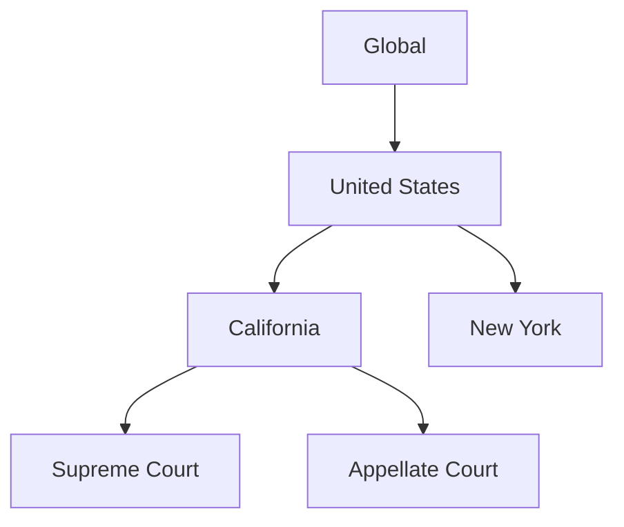

## Overview

Wildlife Studios provides a comprehensive legal knowledge base designed for efficient research and document management. You access advanced search capabilities, annotation tools, jurisdiction-specific organization, and personalized collections to streamline your workflow. These core features empower legal professionals to find relevant case law, statutes, and documents quickly.

<Columns cols={2}>
  <Card title="Advanced Search" icon="search" href="#advanced-search">
    Filter results with powerful operators and save complex queries.
  </Card>
  <Card title="Annotation Tools" icon="highlighter" href="#annotation-tools">
    Highlight, note, and collaborate on documents in real-time.
  </Card>
  <Card title="Jurisdictions" icon="map" href="#jurisdictions">
    Navigate content organized by country, state, and court level.
  </Card>
  <Card title="Collections" icon="folder" href="#collections">
    Build and share custom libraries of resources.
  </Card>
</Columns>

## Advanced Search Filters and Operators

You perform precise legal research using advanced filters like date ranges, jurisdictions, and citation counts. Combine them with Boolean operators (`AND`, `OR`, `NOT`) and phrase searches for targeted results.

<Tabs>
  <Tab title="Boolean Search" icon="search">
    Use standard operators for complex queries.

    <CodeGroup tabs="Query Examples">
      ```lucene
      contract AND dispute AND california
      ```
      ```lucene
      "non-compete agreement" OR "restrictive covenant"
      ```
    </CodeGroup>
  </Tab>
  <Tab title="Filters" icon="filter">
    Apply filters directly in the search bar.

    ````javascript
    // Example API filter structure
    {
      jurisdiction: "CA",
      date: { gte: "2020-01-01" },
      citationCount: { gt: 50 }
    }
    ````
  </Tab>
</Tabs>

<Callout kind="tip">
  Save frequent searches as bookmarks for one-click access. Prefix queries with `filetype:pdf` to limit to documents.
</Callout>

## Document Viewing and Annotation Tools

You view documents in a responsive reader with side-by-side comparisons. Annotate with highlights, sticky notes, and drawings, then export or share.

<Steps>
  <Step title="Open Document" icon="file-text">
    Search and click any result to load in the viewer.
  </Step>
  <Step title="Highlight Text" icon="highlighter">
    Select text and choose a color from the toolbar.
  </Step>
  <Step title="Add Note" icon="message-square">
    Click the note icon and type your comment.
  </Step>
  <Step title="Export Annotations" icon="download">
    Use the share menu to generate annotated PDFs.
  </Step>
</Steps>

## Jurisdiction-Specific Content Organization

Wildlife Studios organizes content hierarchically: global > country > state > court. You browse trees or filter searches by jurisdiction for relevant precedents.



<Expandable title="Advanced Jurisdiction Filters" default-open="false">
  Combine with operators like `jurisdiction:CA AND court:superior`.
</Expandable>

## Personalized Resource Collections

You create collections to organize saved documents, cases, and notes. Share them with teams or export as reports.

<Tabs>
  <Tab title="Create Collection" icon="plus">
    1. Click "New Collection" in the sidebar.
    2. Drag documents from search results.
    3. Add tags like `discovery` or `pleadings`.
  </Tab>
  <Tab title="Share & Collaborate" icon="users">
    Generate shareable links or invite collaborators.
  </Tab>
</Tabs>

<Callout kind="success">
  Collections sync across devices. Use them to build case binders efficiently.
</Callout>

These features integrate seamlessly, enabling you to research, annotate, and manage legal resources in one platform. Start with advanced search to discover the platform's power.